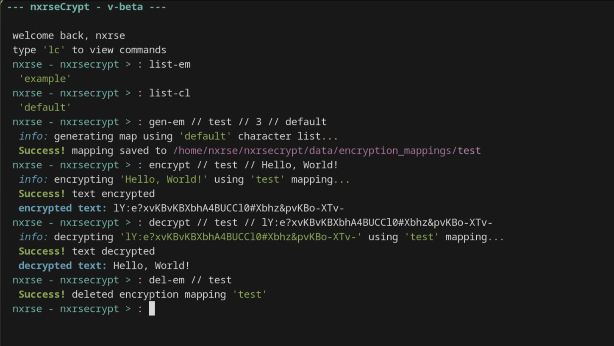

# nxrseCrypt

**Version:** Beta


## Overview

**This software is still in Beta! And is not intended for use yet**

`nxrseCrypt` is a lightweight CLI text encryption/decryption tool, coded in python3.  
It uses mapping files stored in `data/encryption_mappings` to convert characters into chunks of random chracters. Only users with the correct corresponding mapping file can decrypt the text.



! Never share an encryption mapping with anyone you dont want decrypting your encrypted text, keep it secure. !

This is my first big project & github repo, and is not a professional, i made this for fun to communicate privatly with my friends.
Feel free to criticize and report issues.

Only tested on linux,
Let me know if it's compatible with windows and macos

## ✨ Features

- 🔐 Encrypt text using a mapping file.
- 🔓 Decrypt text with the corresponding mapping.
- 🗺️ Support for multiple mapping tables.
- ⚙️ Editable config file.
- ⚠️ Error messages for unsupported characters, invalid encrypted input, etc.
- 💬 CLI feedback with success, error, and info messages.

## 🎯 Use Cases

**Privately messaging others**\
Create an encryption map for a person or group, securely share it with them, and communicate using encrypted text.

**Encrypting documents on external storage**\
If you store sensitive files (notes, passwords, etc.) on a USB drive or other external device, anyone who gets access could read them. Encrypt the text with nxrseCrypt so it cannot be viewed without the corresponding encryption map.

### 🔐 Extra Security Tip

Consider storing several decoy encryption mappings alongside your real ones, and avoid naming important mappings after their actual purpose.

For example, keep 20+ mappings with generic or misleading names. If someone gains access to your system, it becomes much harder for them to identify which mapping is actually used for decrypting sensitive data.


## 📥 Installation

1. 🔗 Clone the repository:

```fish
git clone https://github.com/nxrs3/nxrsecrypt
```

2. 🎨 Install the 'rich' python module:

🐧 Linux:

using pip:

```fish
pip install rich
```

using pacman:

```fish
sudo pacman -S python-rich
```

using apt:

```fish
apt install python3-rich
```

3. ▶️ Create a command to easily run nxrsecrypt:

🐧 Linux:

using bash:

```bash
echo 'mycmd() { python3 ~/nxrsecrypt/main.py; }' >> ~/.bashrc
source ~/.bashrc
```

using zsh:

```zsh
echo 'nxrsecrypt() { python3 ~/nxrsecrypt/main.py; }' >> ~/.zshrc
source ~/.zshrc
```

using fish:

```fish
function nxrsecrypt  
    python3 ~/nxrsecrypt/main.py  
end  
funcsave nxrsecrypt
```


## 🛠️ Usage & commands

### ▶️ Run nxrsecrypt:
```
nxrsecrypt
```
Running if you did not do step 3 of the installation:
```
python3 ~/nxrsecrypt/main.py
``` 

### 🛠️ nxrseCrypt commands

commands are split by ' // ' so for instance, in the command 'a // x // y // z':
'a' is the command, 'x' is argument 1, 'y' is argument 2, 'z' is argument 3

#### 📌 Basic commands:

Show command overview:
```
lc
```
Exit nxrsecrypt:
```
exit
```
Restart nxrsecrypt:
```
restart
```

#### 🗺️ Creating and managing encryption maps:

Listing encryption maps:
```
list-em
```
Deleting an encryption map:
```
del-em // <name of mapping>
```
Generate a map:
```
gen-em // <name> // <chunk length/strength (3-10)> // <character list (anything other than default is not necessary.)>
```
displaying a map:
```
get-em // <name of mapping>
```

#### 📄 Managing encryption mapping chracter lists, if anything other than the default list is needed:

Listing character lists:
```
list-cl
```
Deleting a character list:
```
del-em // <name of character list>
```
Creating a list:
```
create-cl // <name> // <chracters>
```
Displaying a character list:
```
get-cl // <name of list>
```

#### 🔐 Encryption:

Encrypting text:
```
encrypt // <encryption mapping> // <text>
```
Decrypting encrypted text:
```
decrypt // <encryption mapping> // <text>
```

#### 🔄 Reinitialization:
if you wish to reset the state of encryption mappings, character lists, config file,
and other general data, run:
```
reset
```

### ⚙️ Configuration

You can edit the user config file located ~/nxrsecrypt/config.

To add what you modified to the actual config:
```
load-config
```
and
```
restart
```

To reset the config:
```
reset-config
```
and
```
restart
```
